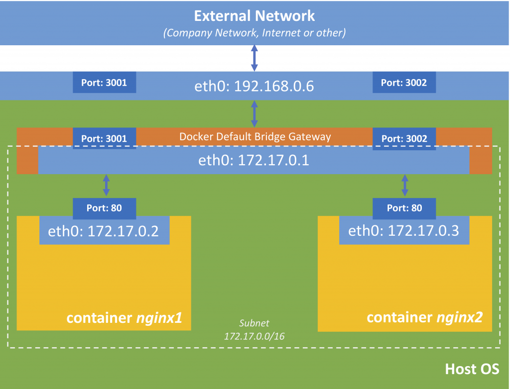

# Points to remember
When a container starts by default it connects to a particular private virtual docker network called "bridge".

Each virtual network routes out through NAT firewall on host IP. This NAT firewall is actually the docker daemon configuring the host IP address, so that the containers can get out on the internet.

We don't need to use the `-p` when we have specific containers that want to talk to each other inside the same virtual network.

Best practice is to create a new virtual network for each app. Example:
- Application 1
    - network "my_web_app"
    - mysql container
    - php/apache container
- Application 2
    - network "my_api"
    - mongo container
    - nodejs container

Here's an example visualization of the bridge network that has two containers inside it.

*Source: [dev.vividbreeze.com](https://dev.vividbreeze.com/docker-networking-bridge-network/)*

In the above example:
- **nginx1** can talk to **nginx2** directly with their private IPs
- access to the **nginx1** from outside the bridge network is made with the IP/port 192.168.0.6:3001
---
`docker container port <container>` 
See the ports that are open in a container.
>**Example:** 
>`$ docker container port mysql8` 

---
`docker container inspect --format '{{ .NetworkSettings.IPAddress}}' <container>` 
Returns the `$.NetworkSettings.IPAddress` value of the JSON response of the `docker container inspect`.

>**Example:** 
>`docker container inspect --format '{{ .NetworkSettings.IPAddress}}' mysql8` 

---
